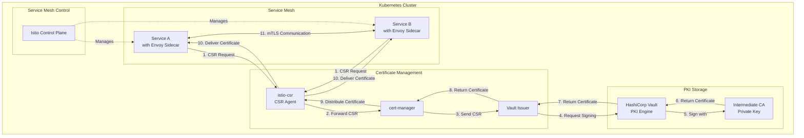

```mermaid
graph TB
    subgraph "Kubernetes Cluster"
        subgraph "Service Mesh"
            ServiceA[Service A<br/>with Envoy Sidecar]
            ServiceB[Service B<br/>with Envoy Sidecar]
        end
        
        subgraph "Certificate Management"
            istio_csr[istio-csr<br/>CSR Agent]
            cert_manager[cert-manager]
            vault_issuer[Vault Issuer]
        end
        
        subgraph "PKI Storage"
            vault[HashiCorp Vault<br/>PKI Engine]
            intermediate_ca[Intermediate CA<br/>Private Key]
        end
        
        subgraph "Service Mesh Control"
            istio[Istio Control Plane]
        end
    end
    
    ServiceA -->|1. CSR Request| istio_csr
    ServiceB -->|1. CSR Request| istio_csr
    istio_csr -->|2. Forward CSR| cert_manager
    cert_manager -->|3. Send CSR| vault_issuer
    vault_issuer -->|4. Request Signing| vault
    vault -->|5. Sign with| intermediate_ca
    intermediate_ca -->|6. Return Certificate| vault
    vault -->|7. Return Certificate| vault_issuer
    vault_issuer -->|8. Return Certificate| cert_manager
    cert_manager -->|9. Distribute Certificate| istio_csr
    istio_csr -->|10. Deliver Certificate| ServiceA
    istio_csr -->|10. Deliver Certificate| ServiceB
    ServiceA <-->|11. mTLS Communication| ServiceB
    
    istio -.->|Manages| ServiceA
    istio -.->|Manages| ServiceB
```
