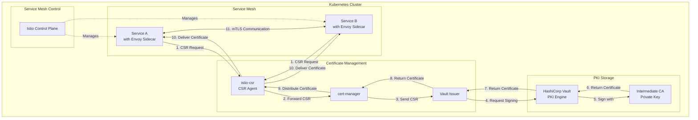

## Overview
This Kubernetes-native PKI implementation consists of the following components:
- HashiCorp Vault which implements PKI storage with root and intermediate CAs
- Cert-manager configured with VaultIssuer to use the Vault as the CA
- Istio which implements the service mesh within k8s cluster

## Explanation
When a service discovered within service mesh wants to communicate with another service alike, it must perform mTLS handshake. So it goes:

1. Service wants to establish connection to another service in the mesh
2. Istio-csr captures the CSR and forwards it to cert-manager
3. Cert-manager sends the CSR to Vault to sign certificates for mTLS handshake (since it is configured to use the vault)
4. Vault Issuer communicates with Vault and requests certificates signing using the Vault's intermediate CA private key
5. The Vault signs certificates and returns them back to service mesh
6. Services can now perform mTLS handshake
